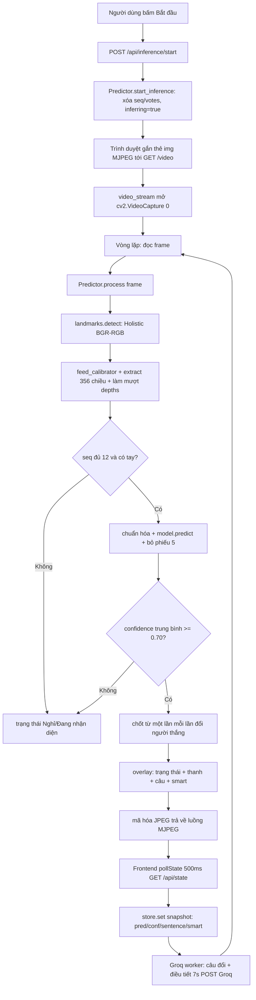
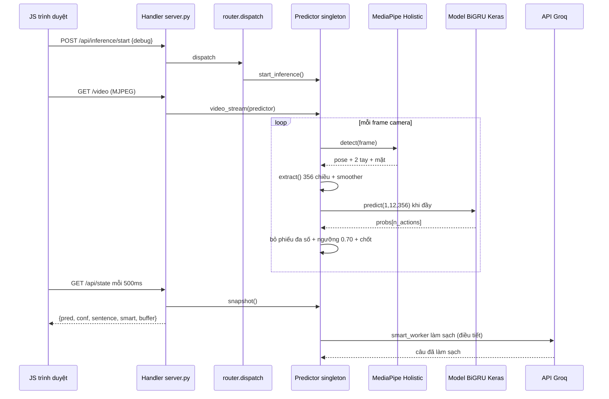

### 5.1 Suy luận live trên web (đường chính)

```mermaid
flowchart TD
    A[Người dùng bấm Bắt đầu] --> B[POST /api/inference/start]
    B --> C[Predictor.start_inference: xóa seq/votes, inferring=true]
    C --> D[Trình duyệt gắn thẻ img MJPEG tới GET /video]
    D --> E[video_stream mở cv2.VideoCapture 0]
    E --> F[Vòng lặp: đọc frame]
    F --> G[Predictor.process frame]
    G --> H[landmarks.detect: Holistic BGR-RGB]
    H --> I[feed_calibrator + extract 356 chiều + làm mượt depths]
    I --> J{seq đủ 12 và có tay?}
    J -- Không --> K[trạng thái Nghỉ/Đang nhận diện]
    J -- Có --> L[chuẩn hóa + model.predict + bỏ phiếu 5]
    L --> M{confidence trung bình >= 0.70?}
    M -- Không --> K
    M -- Có --> N[chốt từ một lần mỗi lần đổi người thắng]
    N --> O[overlay: trạng thái + thanh + câu + smart]
    O --> P[mã hóa JPEG trả về luồng MJPEG]
    P --> Q[Frontend pollState 500ms GET /api/state]
    Q --> R[store.set snapshot: pred/conf/sentence/smart]
    R --> S[Groq worker: câu đổi + điều tiết 7s POST Groq]
    S --> F
```

```mermaid
sequenceDiagram
    participant UI as JS trình duyệt
    participant Srv as Handler server.py
    participant R as router.dispatch
    participant P as Predictor singleton
    participant MP as MediaPipe Holistic
    participant GRU as Model BiGRU Keras
    participant GQ as API Groq
    UI->>Srv: POST /api/inference/start {debug}
    Srv->>R: dispatch
    R->>P: start_inference()
    UI->>Srv: GET /video (MJPEG)
    Srv->>P: video_stream(predictor)
    loop mỗi frame camera
        P->>MP: detect(frame)
        MP-->>P: pose + 2 tay + mặt
        P->>P: extract() 356 chiều + smoother
        P->>GRU: predict(1,12,356) khi đầy
        GRU-->>P: probs[n_actions]
        P->>P: bỏ phiếu đa số + ngưỡng 0.70 + chốt
    end
    UI->>Srv: GET /api/state mỗi 500ms
    Srv->>P: snapshot()
    Srv-->>UI: {pred, conf, sentence, smart, buffer}
    P->>GQ: smart_worker làm sạch (điều tiết)
    GQ-->>P: câu đã làm sạch
```

### 5.2 Đường huấn luyện

```mermaid
flowchart LR
    A[collect_data.py: 15 chuỗi x 12 frame .npy] --> B[load_raw_dataset]
    B --> C[chia stratified: giữ lại test 15 phần trăm]
    C --> D[chia stratified: train / val]
    D --> E[augment_train_data x8 chỉ trên train]
    E --> F[standardize_features thống kê chỉ từ train]
    F --> G[build_model BiGRU + focal loss]
    G --> H[fit: CosineWarmup + Monitor + SmartEarlyStop + Checkpoint + TensorBoard]
    H --> I[nạp lại trọng số val_loss tốt nhất]
    I --> J[đánh giá train-aug / train-sạch / val / test giữ lại + ma trận nhầm lẫn]
```